<picture>
  <source media="(prefers-color-scheme: dark)" srcset="assets/name-dark.svg" />
  <source media="(prefers-color-scheme: light)" srcset="assets/name-light.svg" />
  
</picture>

<picture>
  <source media="(prefers-color-scheme: dark)" srcset="assets/typing-dark.svg" />
  <source media="(prefers-color-scheme: light)" srcset="assets/typing-light.svg" />
  
</picture>

   

 

<picture>
  <source media="(prefers-color-scheme: dark)" srcset="assets/head-hello-dark.svg" />
  <source media="(prefers-color-scheme: light)" srcset="assets/head-hello-light.svg" />
  
</picture>

Hi, I'm **Koushik**, a B.Tech student who builds web and mobile apps end to end, and designs the interfaces that sit on top of them.

- Currently building **GhostMesh**
- Portfolio: **[koushik-gopathi.vercel.app](https://koushik-gopathi.vercel.app)**
- Learning **React Native, Go and system design**
- Fun fact: my voice assistant is called **Karen**, and she actually listens

 

<picture>
  <source media="(prefers-color-scheme: dark)" srcset="assets/head-skills-dark.svg" />
  <source media="(prefers-color-scheme: light)" srcset="assets/head-skills-light.svg" />
  
</picture>

<table>
  <tr>
    <td width="50%" align="center">
      <picture>
        <source media="(prefers-color-scheme: dark)" srcset="assets/radar-skills-dark.svg" />
        <source media="(prefers-color-scheme: light)" srcset="assets/radar-skills-light.svg" />
        
      </picture>
    </td>
    <td width="50%" align="center">
      <picture>
        <source media="(prefers-color-scheme: dark)" srcset="assets/radar-langs-dark.svg" />
        <source media="(prefers-color-scheme: light)" srcset="assets/radar-langs-light.svg" />
        
      </picture>
    </td>
  </tr>
</table>

 

<picture>
  <source media="(prefers-color-scheme: dark)" srcset="assets/head-activity-dark.svg" />
  <source media="(prefers-color-scheme: light)" srcset="assets/head-activity-light.svg" />
  
</picture>

<picture>
  <source media="(prefers-color-scheme: dark)" srcset="assets/stats-dark.svg" />
  <source media="(prefers-color-scheme: light)" srcset="assets/stats-light.svg" />
  
</picture>

<picture>
  <source media="(prefers-color-scheme: dark)" srcset="assets/calendar-dark.svg" />
  <source media="(prefers-color-scheme: light)" srcset="assets/calendar-light.svg" />
  
</picture>

<picture>
  <source media="(prefers-color-scheme: dark)" srcset="https://raw.githubusercontent.com/Koushik-Gopathi/Koushik-Gopathi/output/snake-dark.svg" />
  <source media="(prefers-color-scheme: light)" srcset="https://raw.githubusercontent.com/Koushik-Gopathi/Koushik-Gopathi/output/snake-light.svg" />
  
</picture>

 

<picture>
  <source media="(prefers-color-scheme: dark)" srcset="assets/head-work-dark.svg" />
  <source media="(prefers-color-scheme: light)" srcset="assets/head-work-light.svg" />
  
</picture>

<table>
  <tr>
    <td width="50%">
      <a href="https://github.com/Koushik-Gopathi/Ambyo-AI">
        <picture>
          <source media="(prefers-color-scheme: dark)" srcset="assets/card-1-dark.svg" />
          <source media="(prefers-color-scheme: light)" srcset="assets/card-1-light.svg" />
          
        </picture>
      </a>
    </td>
    <td width="50%">
      <a href="https://github.com/Koushik-Gopathi/gaurdianmesh-threat-detection">
        <picture>
          <source media="(prefers-color-scheme: dark)" srcset="assets/card-2-dark.svg" />
          <source media="(prefers-color-scheme: light)" srcset="assets/card-2-light.svg" />
          
        </picture>
      </a>
    </td>
  </tr>
  <tr>
    <td width="50%">
      <a href="https://github.com/Koushik-Gopathi/ANVI-AI-personal-Assistant-">
        <picture>
          <source media="(prefers-color-scheme: dark)" srcset="assets/card-3-dark.svg" />
          <source media="(prefers-color-scheme: light)" srcset="assets/card-3-light.svg" />
          
        </picture>
      </a>
    </td>
    <td width="50%">
      <a href="https://github.com/Koushik-Gopathi/latest-portfolio">
        <picture>
          <source media="(prefers-color-scheme: dark)" srcset="assets/card-4-dark.svg" />
          <source media="(prefers-color-scheme: light)" srcset="assets/card-4-light.svg" />
          
        </picture>
      </a>
    </td>
  </tr>
</table>

| Project | Live | Stack |
| --- | --- | --- |
| [AmbyoAI](https://github.com/Koushik-Gopathi/Ambyo-AI) | — | Flutter · on-device AI · offline voice |
| [GuardianMesh](https://github.com/Koushik-Gopathi/gaurdianmesh-threat-detection) | [dashboard](https://gaurdianmesh-threat-detection.onrender.com/dashboard) | TypeScript · React |
| [Karen](https://github.com/Koushik-Gopathi/ANVI-AI-personal-Assistant-) | — | Python · Flutter · Groq · Deepgram |
| [Portfolio](https://github.com/Koushik-Gopathi/latest-portfolio) | [koushik-gopathi.vercel.app](https://koushik-gopathi.vercel.app) | Next.js · Tailwind · Framer Motion |

 

Charts, cards and calendar are generated into this repo by <code>scripts/build.mjs</code> and refreshed daily by GitHub Actions.

